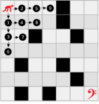
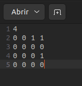
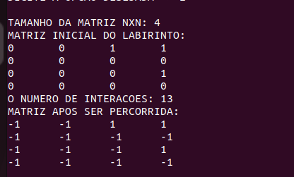

# DFS: Busca em profundidade

 
 
</a> 
</div>

<p align="center">

</p>


<h6><a>O que é DFS?</a></h6>

<p>O DFS é um mecanismos de busca que visa ir o mais profundo em um vértice escolhido da matriz com o objetivo de chegar ao seu final. Prioritariamente foi escolhido para este algoritmo avançar para baixo indo o mais fundo no vértice lateral esquerdo.</p>

<h6><a>Proposta apresentada:</a></h6>

<p>
Foi pedido:

1.1 A criação de um arquivo contendo:

O tamanho de uma matriz quadrada.

Posições das paredes.

Tipo de busca, neste caso o DFS.

1.2 O jogo deveria terminar após o alvo ser atingido.

1.3 Também foi necessário imprimir o caminho feito pelo algoritmo na matriz, mostrando:

Barreiras.

Lugares onde foi relizado`POP`.
Posições onde foram relizados`PUSH`.</p>

 <h6><a>Lógica utilizada:</a></h6>

<h6><a>Leitura e criação do vetor auxliar</a></h6>

<p>
4. Primeiramente utilizamos a função `void Matriz_arq( Item_1 m)` onde:

Na primeira parte do código abrimos o arquivo de configuração **Matriz.txt**.

Lemos a primeira linha do arquivo onde esta definido o tamanho da matriz e salvamos na variavel *m* do tipo `string` e logo transformamos ela no tipo `int`.</p>

```c++
  FILE *arq_m;
	ifstream arq;
	string m;
	arq.open("Matriz.txt");
	if(arq.is_open()){
		getline(arq, m);
		n = stoi(m);
	}
```

<p>Em seguida, começamos a ler caracter por caracter do arquivo, salvando apenas aqueles caracters que eram iguais a *0* ou *1* e adicionandos em um vetor auxiliar:</p>

```c++
  int Total;
	Total=n*n;
	arq.close();
	arq_m = fopen("Matriz.txt","r");
	for ( int l = 0; l < Total ; ){
		d.vaux = fgetc(arq_m);
		m=d.vaux;
		if(m == "1"|| m == "0"){
			vetaux[l] = m;
			l++;
		}
	}

```
<h6><a>Andando na matriz utilizando o DFS</a></h6>

<p>5. Para relização desta parte do algoritmo utilizamos a função `void Anda_labirinto();` onde:

Primeiramente declaramos algumas variáveis importante como:</p>

```c++
  Pilha column,lines;
  Item co,li;	
  string Matriz[n][n];
  bool Limite=false;
  int aux=0,l,c,Coluna=0,Linha=0;
```
<p>Após isso, passamos os valores do vetor auxiliar para nossa matriz e exibimos ela na tela para o usuário.</p>

```c++
  cout<<"Matriz escolhida para ser percorrida:"<<endl;

  for ( l = 0; l < n; l++){
      for ( c = 0; c < n; c++){ 
        Matriz[l][c]=vetaux[aux];
          aux++;
        cout<<Matriz[l][c]<<" ";
      } 
        cout<<endl;
  }
    cout<<"-------------"<<endl;
    cout<<endl;
    cout<<endl;
```
<p>Em seguida, utilizamos de um **while** para percorrer a matriz de forma a chegar no final dela.

Dentro deste *while* foi utilizado 4 chaves de **if's** princípais.

Dois destes com a intenção de andar para baixo e para direita dando um **PUSH** nas posições da matriz:</p>

```c++
if(l<(n-1)&&Matriz[l+1][c]=="0"){
	while (l!=(n-1)&&Matriz[l+1][c]=="0"){
		cout<<"PUSH"<<" "<<"nas posições :"<<endl;
		cout<<"Linha: "<<l<<endl;
		cout<<"Coluna: "<<c<<endl;
		l++; 
		li.val=l;
		Push(&lines, li);
		Matriz[l][c]="v"; 	
		Linha++;				
	}		
}else if(c<(n-1)&&Matriz[l][c+1]=="0"){
	while (c!=(n-1)&&Matriz[l][c+1]=="0"){
		cout<<"PUSH"<<" "<<"nas posições :"<<endl;
		cout<<"Linha: "<<l<<endl;
		cout<<"Coluna: "<<c<<endl;
		c++;
		co.val = c;
		Push(&column,co);
		Matriz[l][c]=">";
		Coluna++;	
	}	
}
```
Repare que por onde acontece o **PUSH** atribuímos os valores de `V` para baixo e `>` para direita.

Os outros dois **if's** foram feitos para andar para cima e para esquerda dando um **POP** na posição atual da matriz:

```c++
else if(Coluna!=0&&c>0){
	cout<<"POP"<<" "<<"nas posições :"<<endl;
	cout<<"Linha: "<<l<<endl;
	cout<<"Coluna: "<<c<<endl;
	Matriz[l][c]="<";
	Pop(&column,&co);
	Coluna--;
	c=co.val; 				
}
	else if(Linha!=0&&l>0){
		cout<<"POP"<<" "<<"nas posições :"<<endl;
		cout<<"Linha: "<<l<<endl;
		cout<<"Coluna: "<<c<<endl;
		Matriz[l][c]="A";
		Pop(&lines,&li);
		l=li.val;
		Linha--;	
	}
```
- Repare que após o **POP** as posições da matriz são atualizadas
 - repare também que ao andar para esquerda é atribuída a posição o símbolo `<` e para cima a letra `A`.
    
  Por fim, utilizamos um **else** para fechar o programa caso nao haja solução para chegar no final da matriz. Finalizamos o **while** e imprimimos o resultado da matriz na tela do usuário.

```C++
  else{
	cout<<"Impossivel chegar no final da matriz"<<endl;
	Limite=true;
	}
	if((n-1)*(n-1)==l*c){
		Limite=true;
	}

cout<<"Matriz percorrida:"<<endl; 
cout<<endl;
for ( l = 0; l < n; l++){
  	for ( c = 0; c < n; c++){ 
		 cout<<Matriz[l][c]<<" ";
  	}
	  cout<<endl;
}
```

 <h6><a>Funcionamento Aquivo "Matriz.txt":</h6></a>
 
<p>O arquivo deve ser um aquivo txt.

   Conter até no máximo uma matriz 10 por 10.

   O arquivo deve apresentar na primeira linha o tamamho desejado da matriz.

   Logo abaixo a matriz desejada.</p>

*EX*:

```
 	7
	0   0   0   0   1   0   0
	0   0   0   0   1   0   0
	0   0   1   0   0   1   0
	0   0   0   0   0   0   0
	0   1   0   0   1   0   0
	0   0   0   0   0   0   1
	0   1   0   1   1   0   0 
``` 

# BFS: Busca em largura

<h6><a>O que é BFS?</a></h6>
<p>Busca em largura (ou busca em amplitude, também conhecido em inglês por <strong>Breadth-First Search - BFS</strong> é um algoritmo de busca utilizado para realizar uma busca ou travessia num grafo e estrutura de dados do tipo árvore. Intuitivamente, você começa pelo vértice raiz e explora todos os vértices vizinhos. Então, para cada um desses vértices mais próximos, exploramos os seus vértices vizinhos inexplorados e assim por diante, até que ele encontre o alvo da busca. Formalmente, uma busca em largura é um método de busca não-informada (ou desinformada) que expande e examina sistematicamente todos os vértices de um grafo direcionado ou não-direcionado.</p>
<p align="center">
 
</p>

<h6><a>Como usar o nosso algoritmo de busca em largura?</a></h6>
<p align="justify">
Na pasta principal do algoritmo há um arquivo .txt chamando Matriz_DFS, como mostra a imagem abaixo nele você configura a matriz que deseja que seu algoritmo de busca em largura trabalhe, na primeira linha você digita o tamanho da sua matriz, lembre-se que ela é uma matriz NxN, logo deve digitar somente um único número. Em seguida digite sua matriz NxN, <strong>onde o número zero são caminhos livres para passar e o número 1 são barreiras.</strong>
</p>
<p align="center">

</p>

<p>Após a execução, seu algoritmo irá imprimir o tamanho da matriz, a matriz incial, o número de interações que foram realizadas e o caminho percorrido pelo seu algoritmo que corresponde as casas preenchidas com o número -1 como mostra a imagem abaixo:</p>
<p align="center">

</p>

| Comando                |  Função                                                                                           |                     
| -----------------------| ------------------------------------------------------------------------------------------------- |
|  `make clean`          | Apaga a última compilação realizada contida na pasta build                                        |
|  `make`                | Executa a compilação do programa utilizando o g++, e o resultado vai para a pasta build           |
|  `make run`            | Executa o programa da pasta build após a realização da compilação                                 |

# Alunos

Estudantes do curso de AEDS 1 de 2022 do CEFET-MG campus V.

Caio Fernando Dias
João Marcelo Gonçalves Lisboa

# Contato

<div style="display: inline-block;">
<a href="https://t.me/caio_fer_dias">
 </div>

